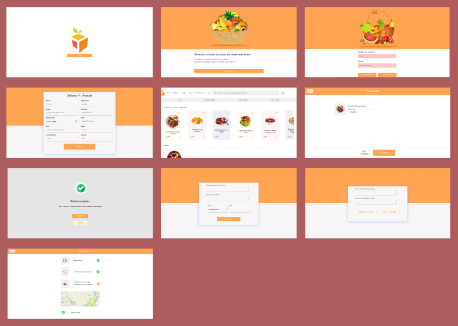

<h1 align="center">
    
</h1>

<h1 align="center">
   <a href="#"> Delivery Armazém</a>
</h1>

<h3 align="center">
    Projeto desenvolvido para conclusão do curso de desenvolvimento de sistemas 
</h3>

<h4 align="center"> 
	 Status: Em desenvolvimento
</h4>

## Layout do projeto

📚 [figma](<https://www.figma.com/file/zhwkuDA72h40SZtvUmiwTK/UI%2FInteraction-Design-(Copy)?node-id=12%3A0>)

     •
    <a href="#">Click Aqui </a> •
    

## Sobre

Um site com telas de etapas de compra...

---

## Recursos

- Html
  - [x] Estrutura pronta
- Css
  - [x] Definir fonte e classes de style
  - [x] Fidelidade ao Layout
- Design responsivo
  - [x] Todas as telas
- Javascript
  - [x] Rotas de navegação
  - [x] Criar itens de compra
  - [x] filtro dos itens de compra
  - [x] Favoritar item
  - [x] Botão de soma da Página Home
  - [x] Validar cadastro
  - [ ] Validar perfil
  - [ ] Barra de pesquisa
  - [x] Consumo de API
  - [x] Funcionalidade de ocultar/mostrar senha
  - [x] Bloqueio de caracter especial no input
  - [x] Carrossel de compra
  - [x] Menu responsivo
  - [x] Mascara para os inputs
- Back-end
  - [x] Puxar valores do cadastro
  - [x] Revalidar dados do cadastro
  - [x] Conexão com SQL
  - [x] Enviar informações a tabela usuários
  
  
---

## Autor

 
 
 
 
 
 

---

## Referências

- [W3Schools referência HTML](https://www.w3schools.com/tags/default.asp)
- [W3Schools referência CSS](https://www.w3schools.com/cssref/default.asp)
- [Google Fonts](https://fonts.google.com/)
- [Coolors](https://coolors.co/palettes/trending)
- [Paletton](https://paletton.com/)
- [W3Schools propriedades CSS no DOM](https://www.w3schools.com/jsref/dom_obj_style.asp)
- [MDN lista de eventos](https://developer.mozilla.org/en-US/docs/Web/Events)
